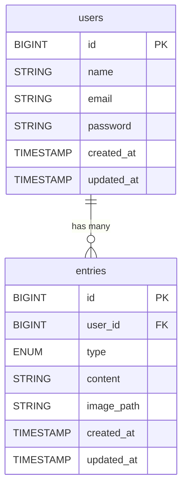

# ポジティブ体験の蓄積に特化した、ビジュアル型ジャーナルアプリ「Gleam Jar」

> *日々のささやかな宝物をひろいあげる。あしたを少しだけ前向きにする願いをこめて・・・*

## コンセプト

日々の小さな「良かったこと」を書きとめて、瓶に貯めていくことができます。 
月ごとに書きとめた数に応じて美しい天然石をもらうことができ、自分だけの宝箱ができあがります。 
 
Gleam Jarは「書いた事実」を守ります。 
削除ではなく編集のみが可能で、書いた事実は消えません。 
落ち込んだときほど、過去の良かった記憶を否定したくなります。 
「あんなの良かったことじゃなかった」「浮かれていただけ」—— 
そんなふうに思ってしまうタイミングで、せっかく貯めたものを衝動的に消してしまわないように。 

## 主な機能

### (1) 書き込み
・💜（ハート）: 内面の変化・自分についての良かったこと 
・⭐（スター）: 外の出来事の良かったこと 
・ハートとスター、いずれも1日何個でも書ける（225文字以内 / 画像1枚までアップロード可能） 
【ER図】  

　※ type は heart または star を格納  
　※ content は 最大255文字  
　※ image_path は NULLも可  
　※ created_at 書き込み時点時刻を出来事の時刻とする  

### (2) 石のシステム
月の書き込み数に応じて、もらえる石がグレードアップします。 
書き込み数が少なめでも綺麗な石がもらえて、書き込むほどより幻想的な石が手に入ります！ 
何も書けなかった月もきれいな原石（ジオード）がもらえます。 
｟石のグレードアップの流れ｠ 
ジオード→黒曜石→スモーキークォーツ→カーネリアン→シトリン→パイライト→グリーンアベンチュリン→蛍石→アマゾナイト→ラピスラズリ→アメジスト→ラブラドライト→水晶→ムーンストーン 
※グレードアップするにつれてより幻想的な石に変化します。

### (3) ログ表示
・日時で書き込んだ内容を遡れる 
・💜 / ⭐ ごとにフィルタリング可能 
・キーワード検索 

### (4) マスコット
瓶が空のときも寂しくならないように、 
瓶のそばには、あなたを見守る黒猫がいます。 

### (5) ログイン・ユーザ登録
・新規登録: アカウントを作成できます。
・ログイン: 自分のアカウントにアクセスでき、いつでも内容にアクセスできます。

### (6) 通知機能
・リマインダー機能:
毎週日曜日に次のレベルの石がもらえるまでの書き込み数をメール通知でお知らせします。

## 技術スタック

| カテゴリ    | 技術        | 
|:----------:|:-----------:|
| バックエンド | PHP 8.3 / Laravel 12 |
| フロントエンド | React / Node.js |
| データベース | PostgreSQL |
| 認証 | Laravel Breeze |
| インフラ | Docker (Laravel Sail) |
| テスト | PHPUnit / Mockery |
| API設計 | OpenAPI / Swagger（予定）|
| CI/CD | GitHub Actions（予定）|
